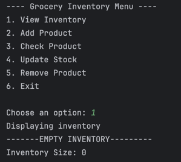
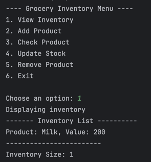
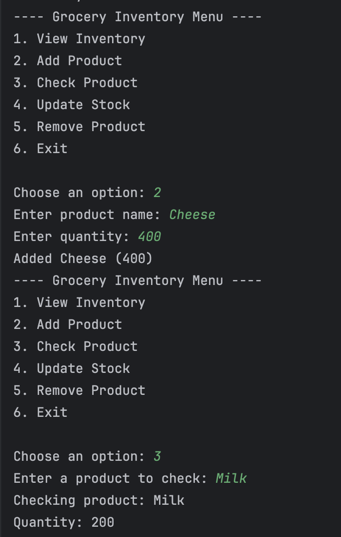
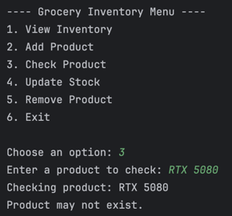
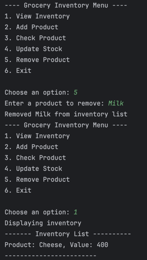
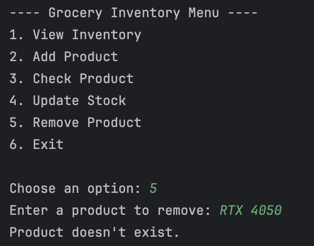

# Lab 1: Part 1 of 2 Grocery Store Inventory System
## Author: Nicholo Pardines
# Unit Testing
# Demo Output
## View Empty Inventory

## Adding an Item

## Viewing Inventory

## Checking an Existing Product

## Checking a Non-Existent Product

## Removing a Product

## Trying to Remove a Non-Existent Product

# Unit Testing
